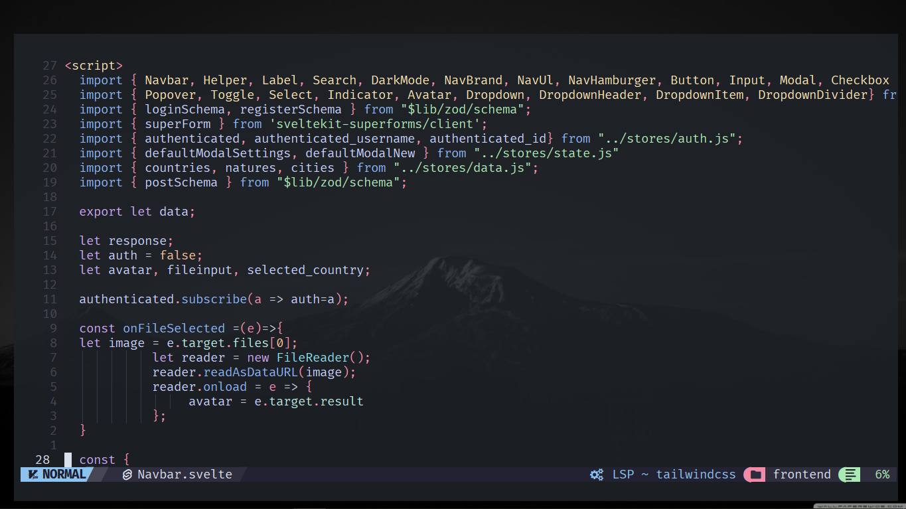

# Mercibac's dotfiles

## Configuration

- Terminal: [wezterm](https://wezterm.org/)
- Shell: [nushell](https://github.com/nushell/nushell) and [powershell](https://github.com/PowerShell/PowerShell)
- Editor: [neovim](https://github.com/neovim/neovim)
- Prompt: [starship](https://github.com/starship/starship)
- Window manager: [komorebi](https://github.com/LGUG2Z/komorebi)
